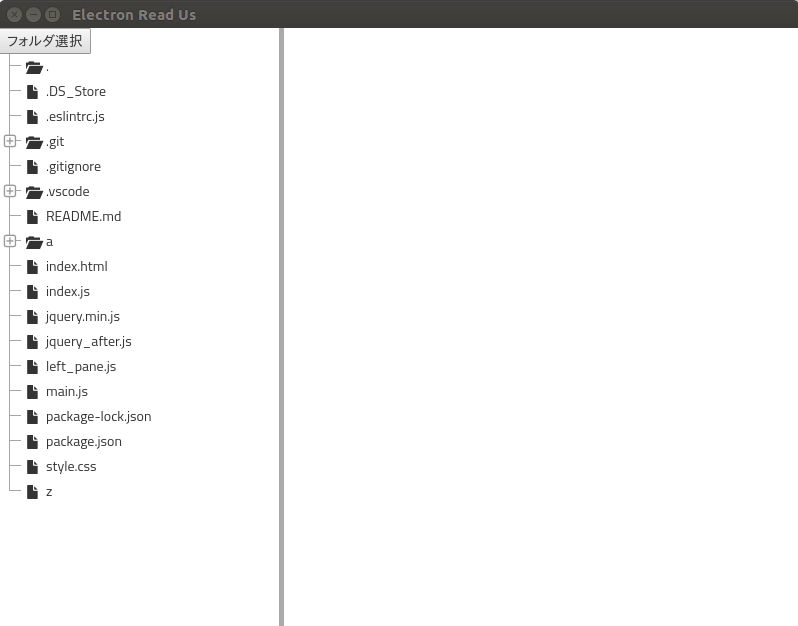

# electron_training

## 概要

openFOAMデータの設定を簡易的に行えるアプリケーション

## 機能

* openFOAMのファイルを容易に変更可能
* ファイルの選択機能
* 作成ファイルのセーブ機能

## デモ



## 使い方

```
$ electron .
```

## インストール

```
$ git clone https://github.com/kurenaif/openfoam_setting_tool
$ cd openfoam_setting_tool
$ npm install
```

## クイックスタート

```
$ git clone https://github.com/kurenaif/openfoam_setting_tool
$ cd openfoam_setting_tool
$ npm install
$ npm start
$ git clone https://github.com/kurenaif/openFOAM-tutorial-cylinder
$ cd electron_training
$ npm start
```


## 作成者

* [kurenaif](https://github.com/kurenaif)
* [takemasa0118](https://github.com/takemasa0118)
* [mt1322](https://github.com/mt1322)
